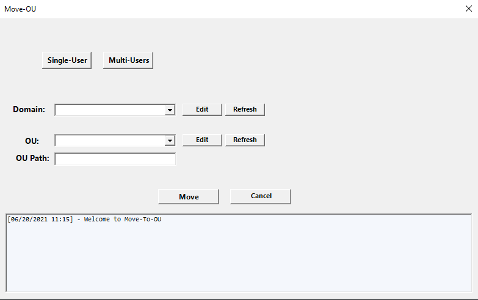

<!--
*** Thanks for checking out the Best-README-Template. If you have a suggestion
*** that would make this better, please fork the repo and create a pull request
*** or simply open an issue with the tag "enhancement".
*** Thanks again! Now go create something AMAZING! :D
-->


<!-- PROJECT SHIELDS -->
<!--
*** I'm using markdown "reference style" links for readability.
*** Reference links are enclosed in brackets [ ] instead of parentheses ( ).
*** See the bottom of this document for the declaration of the reference variables
*** for contributors-url, forks-url, etc. This is an optional, concise syntax you may use.
*** https://www.markdownguide.org/basic-syntax/#reference-style-links
-->


<!-- PROJECT LOGO -->
<br />
<p align="center">
  <a href="https://github.com/tRamada/Move-To-OU">
    
  </a>

  <h3 align="center">Move-To-OU</h3>

  <p align="center">
    A script that will make you save time!
    <br />
    <a href="https://github.com/tRamada"><strong>Explore my GitHub »</strong></a>
    <br />
    <br />
    <a href="https://tramada.github.io/">->My Online-Portofolio<-</a>
  </p>
</p>


<!-- TABLE OF CONTENTS -->
<details open="open">
  <summary>Table of Contents</summary>
  <ol>
    <li>
      <a href="#about-the-project">About The Project</a>
      <ul>
        <li><a href="#built-with">Built With</a></li>
      </ul>
    </li>
    <li>
      <a href="#getting-started">Getting Started</a>
      <ul>
        <li><a href="#prerequisites">Prerequisites</a></li>
        <li><a href="#installation">Installation</a></li>
      </ul>
    </li>
    <li><a href="#usage">Usage</a></li>
    <li><a href="#license">License</a></li>
    <li><a href="#contact">Contact</a></li>
    <li><a href="#acknowledgements">Acknowledgements</a></li>
  </ol>
</details>


<!-- ABOUT THE PROJECT -->
## About The Project



This 'Move-To-OU' was done in PowerShell to automate the User/User's move between OU path from Active Directory (Windows Server).

Here's why:
* Save time
* Easier
* Simple :smile:

I built this program with my own, is my first 'big' project I have ever done in my career of Software Development.

A list of commonly used resources that I find helpful are listed in the acknowledgements.

### Built With

This section should list any major frameworks that you built your project using.
* [PowerShell](https://docs.microsoft.com/en-us/powershell/scripting/overview?view=powershell-7.1)
* [FontAwnsome](https://fontawesome.com/)


<!-- GETTING STARTED -->
## Getting Started

This is a simple guide to help you using the program.

### Prerequisites

This is an example of how to list things you need to use the software and how to install them.
* PowerShell
  ```sh
  https://docs.microsoft.com/pt-pt/powershell/scripting/install/installing-powershell?view=powershell-7.1
  ```

### Installation

1. Check if you have PowerShell instaled in your computer.
2. Clone the repo
   ```
   git clone https://github.com/tRamada/Move-To-OU.git
   ```
3. Right-Click on 'app.ps1'
4. Run with PowerShell


<!-- USAGE EXAMPLES -->
## Usage

Use this program in Windows Server to move one or more user's to a different OU path.

<!-- _For more examples, please refer to the [Documentation](https://example.com)_ -->


<!-- LICENSE -->
## License

Distributed under the MIT License. See `LICENSE` for more information.


<!-- CONTACT -->
## Contact

Tiago Ramada - tiago@diasramada.eu

Project Link: [https://github.com/tRamada/Move-To-OU](https://github.com/tRamada/Move-To-OU)


<!-- ACKNOWLEDGEMENTS -->
## Acknowledgements
* [GitHub Emoji Cheat Sheet](https://www.webpagefx.com/tools/emoji-cheat-sheet)
* [Choose an Open Source License](https://choosealicense.com)
* [Font Awesome](https://fontawesome.com)
